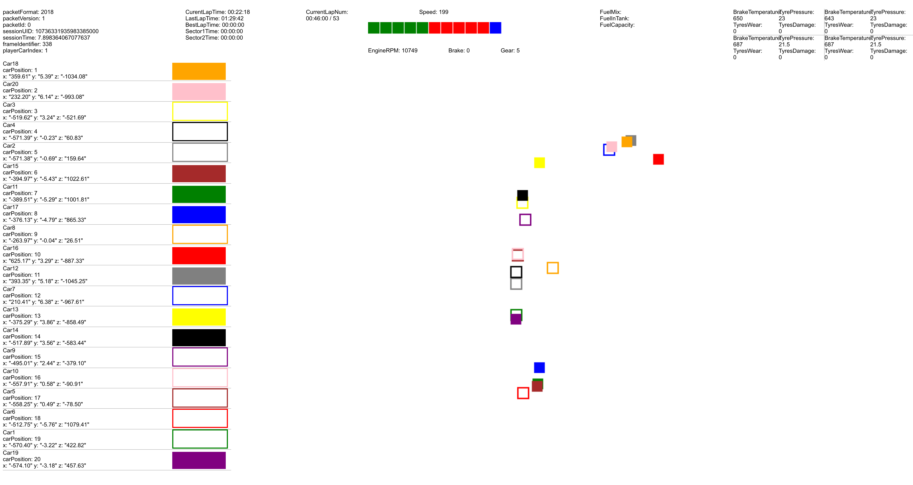
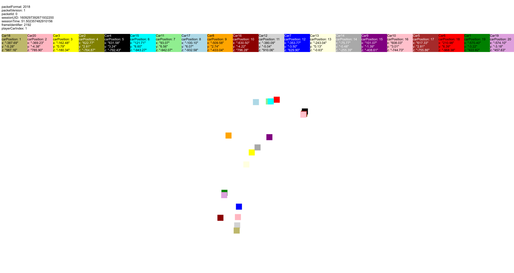

In order to run the websocket, you will need to install tornado:

A little info about tornado from their [site](https://www.tornadoweb.org/en/stable/):

*"Tornado is a Python web framework and asynchronous networking library, originally developed at FriendFeed. By using non-blocking network I/O, Tornado can scale to tens of thousands of open connections, making it ideal for long polling, WebSockets, and other applications that require a long-lived connection to each user."*

    pip install tornado

## Running The WebSocket

To run the websocket, there are two options.

* Default when running the websocket for both of the following udp_port is set to 5003, the pcap emultor

* directions to switch over to F1 packet broadcasting are below

### Users Car Packet View

To run the user car packets view simply run:

    python tornado_broker.py

To run with pcap emulator or with the actual f1 game, simply comment out the correct line in tornado_broker:

    119  # For using with the live F1 2018 game
    120  # listning_ip_address     = ''
    121  # udp_port                = 20777
    122  
    123  # For using the pcap emulator
    124  listning_ip_address     = '127.0.0.1'
    125  udp_port                = 5003

Go to your web browser and enter:

    http://localhost:9090/

### Live Map View

To run the live map view simply run:

    python live_map_tornado.py

To run with pcap emulator or with the actual f1 game, simply comment out the correct line in live_map_tornado:

    124  # For using with the live F1 2018 game
    125  # listning_ip_address     = ''
    126  # udp_port                = 20777
    127      
    128  # For using the pcap emulator
    129  listning_ip_address     = '127.0.0.1'
    130  udp_port                = 5003

Go to your web browser and enter:

    http://localhost:9090/

### Live Map with Telemetry View

To run the live map view simply run:

    python map_telemetry_tornado.py

To run with pcap emulator or with the actual f1 game, simply comment out the correct line in live_map_tornado:

    124  # For using with the live F1 2018 game
    125  # listning_ip_address     = ''
    126  # udp_port                = 20777
    127      
    128  # For using the pcap emulator
    129  listning_ip_address     = '127.0.0.1'
    130  udp_port                = 5003

Go to your web browser and enter:

    http://localhost:9090/

### Live Map View Efficiency Test

To run the live map view efficiency test simply run:

    python live_map_tornado_efficiency_test.py

To run with pcap emulator or with the actual f1 game, simply comment out the correct line in live_map_tornado:

    124  # For using with the live F1 2018 game
    125  # listning_ip_address     = ''
    126  # udp_port                = 20777
    127      
    128  # For using the pcap emulator
    129  listning_ip_address     = '127.0.0.1'
    130  udp_port                = 5003

Go to your web browser and enter:

    http://localhost:9090/

### Live Telemetry Dashboard

To run the Telemetry Dashboard simply run:

    python telemetry_dashboard_tornado.py

To run with pcap emulator or with the actual f1 game, simply comment out the correct line in live_map_tornado:

    124  # For using with the live F1 2018 game
    125  # listning_ip_address     = ''
    126  # udp_port                = 20777
    127      
    128  # For using the pcap emulator
    129  listning_ip_address     = '127.0.0.1'
    130  udp_port                = 5003

Go to your web browser and enter:

    http://localhost:9090/

## Screen shots
### USERS CAR PACKET DATAS

### LIVE MAP

### LIVE MAP + TELEMETRY

### LIVE MAP EFFICIENCY TEST

### Live Telemetry Dashboard

