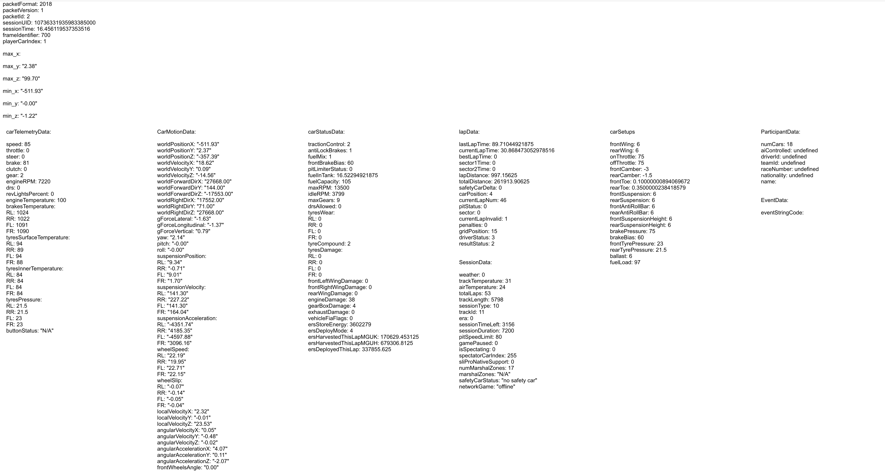
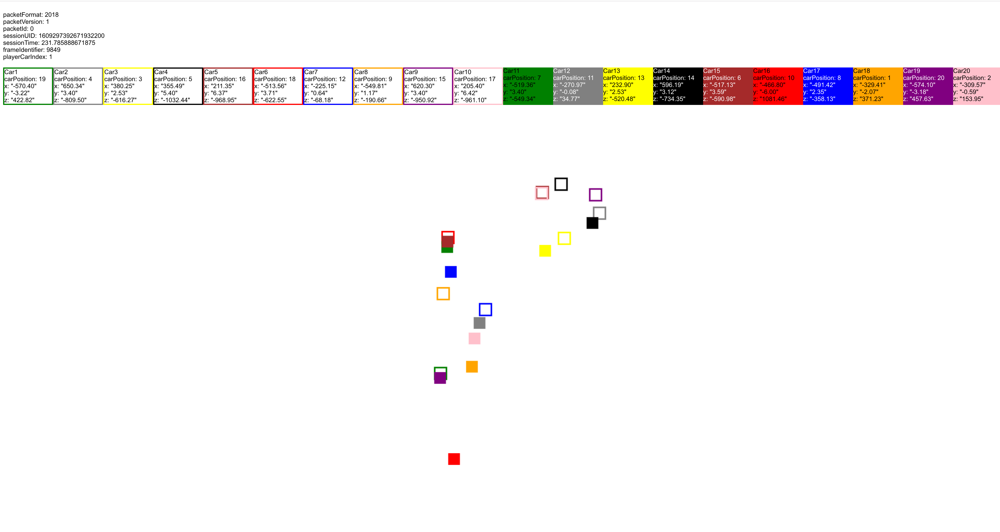

In order to run the websocket, you will need to install tornado:

    pip install tornado

to run the websocket:

    python tornado_broker.py

Go to your web browser and enter:

    http://localhost:9090/

To change the GUI, simply comment out which GUI you would like to run.

This code can be found in lines 80-81 in tornado_broker.py

The following is the current, which at default will display map_draw_live.html, showing live maps:

    class HTMLHandler(tornado.web.RequestHandler):
        """ HTML handler """
        def get(self):
            loader = tornado.template.Loader(".")
            # self.write(loader.load("user_car_packets_view.html").generate())
            self.write(loader.load("map_draw_live.html").generate())

Examples of current visuals:

## Screen shots
### USERS CAR PACKET DATAS

### LIVE MAP

